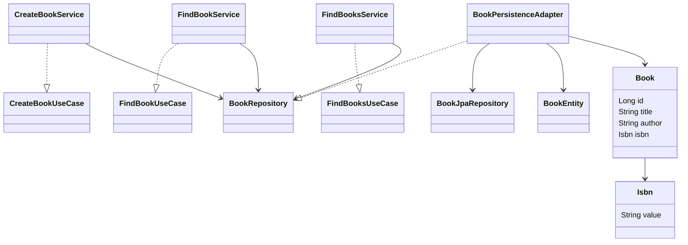
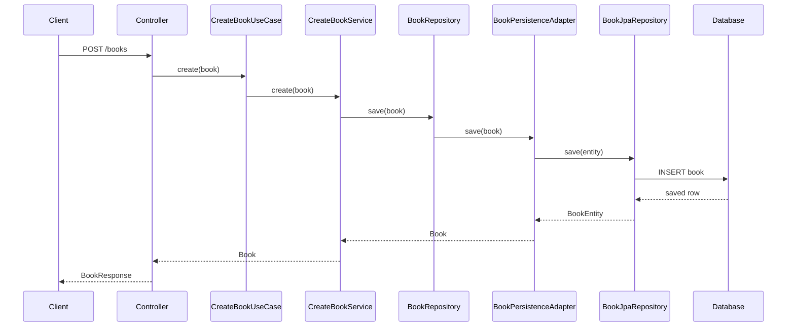

# Library Application

RESTful API POC built with Spring Boot, following the principles of **Domain-Driven Design (DDD)** and **Hexagonal Architecture (Ports and Adapters)**.

## Overview

This project was created as a study project to demonstrate the implementation of a simple Library Management API using:

- Domain-Driven Design (DDD)
- Hexagonal Architecture
- Spring Boot
- Spring Data JPA
- H2 Database
- OpenAPI / Swagger

The main goal is to show how business rules can remain independent of frameworks, persistence technologies, and external systems.

---

## Objectives

This POC demonstrates:

- Entity modeling
- Value Objects
- Use Cases
- Input Ports
- Output Ports
- Application Services
- Persistence Adapters
- DTO Mapping
- Dependency Inversion
- Framework Isolation

---

## Technologies

- Java 25
- Spring Boot
- Maven
- Spring Web
- Spring Data JPA
- Hibernate / JPA
- H2 Database
- Bean Validation
- REST / HTTP
- OpenAPI / Swagger

---

## Architecture

The project follows the **Hexagonal Architecture (Ports and Adapters)** pattern.

```text
Client
   │
   ▼
Input Adapter
(Controller)
   │
   ▼
Input Port
(Use Case)
   │
   ▼
Application Service
   │
   ▼
Output Port
(Repository Interface)
   │
   ▼
Persistence Adapter
   │
   ▼
Spring Data JPA
   │
   ▼
Database
```

### Layer Responsibilities

#### Domain

Contains the business model and business rules.

```text
domain
├── model
└── exception
```

The domain does not depend on:

- Spring
- JPA
- HTTP
- Swagger

#### Application

Contains:

- Use Cases
- Ports
- Application Services

```text
application
├── port
└── service
```

The application defines what it needs but does not know how it is implemented.

#### Adapters

Responsible for communication with the outside world.

```text
adapter
├── in
└── out
```

Examples:

- REST Controllers
- DTOs
- JPA Repositories
- Persistence Adapters

---

## Package Structure

```text
src/main/java
└── com.ricardo.PoCLibrary
    ├── PoCLibraryApplication.java
    │
    ├── adapter
    │   ├── in
    │   │   └── web
    │   │       ├── BookController.java
    │   │       ├── dto
    │   │       │   ├── BookResponse.java
    │   │       │   └── CreateBookRequest.java
    │   │       ├── exception
    │   │       │   ├── GlobalExceptionHandler.java
    │   │       │   └── StandardError.java
    │   │       └── mapper
    │   │           └── BookMapper.java
    │   │
    │   └── out
    │       └── persistence
    │           ├── BookEntity.java
    │           ├── BookJpaRepository.java
    │           ├── BookPersistenceAdapter.java
    │           └── mapper
    │               └── BookPersistenceMapper.java
    │
    ├── application
    │   ├── port
    │   │   ├── in
    │   │   │   ├── CreateBookUseCase.java
    │   │   │   ├── FindBooksUseCase.java
    │   │   │   └── FindBookUseCase.java
    │   │   └── out
    │   │       └── BookRepository.java
    │   │
    │   └── service
    │       ├── CreateBookService.java
    │       ├── FindBooksService.java
    │       └── FindBookService.java
    │
    ├── config
    │   ├── BeanConfig.java
    │   └── TestConfig.java
    │
    └── domain
        ├── exception
        │   ├── BookNotFoundException.java
        │   ├── InvalidBookException.java
        │   └── InvalidIsbnException.java
        │
        └── model
            ├── Book.java
            └── Isbn.java
```

---

# API Endpoints

## Create Book

### Request

```http
POST /books
```

```json
{
  "title": "Clean Code",
  "author": "Robert C. Martin",
  "isbn": "9780132350884"
}
```

### Response

```json
{
  "id": 1,
  "title": "Clean Code",
  "author": "Robert C. Martin",
  "isbn": "9780132350884"
}
```

---

## Find All Books

```http
GET /books
```

---

## Find Book By Id

```http
GET /books/{id}
```

Example:

```http
GET /books/1
```

---

## Find Book By ISBN

```http
GET /books/isbn/{isbn}
```

Example:

```http
GET /books/isbn/9780132350884
```

---

## Error Handling

Business exceptions are handled through a centralized exception handler.

Example:

```json
{
  "timestamp": "2026-09-24T18:00:00Z",
  "status": 404,
  "error": "Book not found",
  "message": "Book not found",
  "path": "/books/100"
}
```

---

## Sample Data

The application starts with sample books loaded through `TestConfig`.

- Clean Code
- Effective Java
- Domain-Driven Design
- Refactoring
- Clean Architecture

---

## Swagger Documentation

```text
http://localhost:8080/swagger-ui/index.html#/
```

---

## Running the Application

### Clone Repository

```bash
git clone https://github.com/ricardobfernandes/POC-DDD-HEXAGONAL.git
```

### Navigate to Project Folder

```bash
cd POC-DDD-HEXAGONAL
```

### Run Application

```bash
mvn spring-boot:run
```

Or simply run:

```text
PoCLibraryApplication.java
```

from your IDE.

---

## Class Diagram



---

## Sequence Diagram - Create Book



---

## Hexagonal Architecture Summary

| Layer | Responsibility |
|---------|-------------|
| Controller | Input Adapter |
| Use Case | Input Port |
| Service | Application Layer |
| Repository | Output Port |
| Persistence Adapter | Output Adapter |
| JPA Repository | Infrastructure

---

## Author

Ricardo Fernandes

Product Engineering Analyst

GitHub: https://github.com/ricardobfernandes